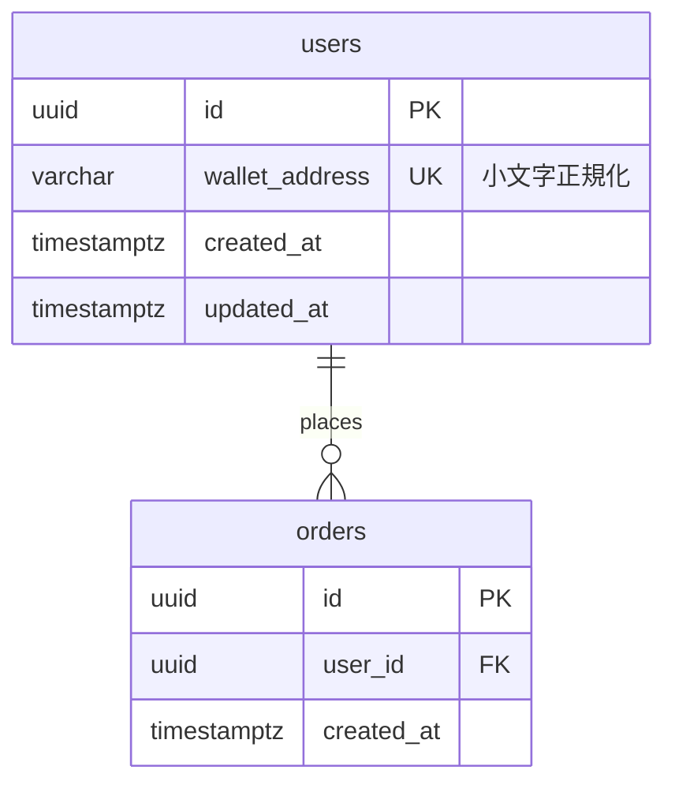

# database-design

`docs/` 配下の設計資料をもとに、**ER 図（Mermaid）** と **データベース設計書** を `docs/database/` に作成する。

## 1. 入力資料を集める

`docs/` 配下を一覧し、次の資料を読む（`docs/database/` 自体は入力から除く。既存の設計書は更新時の差分確認にだけ使う）:

| 種類 | 探し方 | 読み方 |
|------|--------|--------|
| 要件定義 | ファイル名に「要件」「requirements」「仕様」等 | そのまま Read |
| ユースケース | ファイル名に「ユースケース」「usecase」等 | PDF は Read の `pages` 指定で全ページ読む |
| アーキテクチャ図 | `*.svg` / `*.png` / `*.drawio` 等 | SVG は `<text>` 要素を抽出して読む（例: `grep -o '<text[^>]*>[^<]*' file.svg \| sed 's/<[^>]*>//'`）。画像は Read で見る |

- アーキテクチャ図が複数案ある場合（例: `01-アーキテクチャ図.svg` と `02-アーキテクチャ図-WorldMiniApp案.svg`）、どれを前提にするかが資料から読み取れなければユーザーに確認する。
- 要件定義など想定資料が無い場合は、ある資料だけで進め、設計書の「前提・参照資料」に不足を明記する。

## 2. データモデルを設計する

資料から次を洗い出す:

1. **エンティティ**: ユースケースの登場人物（アクター）、操作対象、記録すべき出来事（履歴・トランザクション）。
2. **属性**: 各ユースケースの入出力・画面項目・検索条件から必要なカラムを導く。
3. **リレーション**: 1:1 / 1:N / N:M を判定し、N:M は中間テーブルに分解する。
4. **データの置き場所**: アーキテクチャ上のコンポーネント（オンチェーン / オフチェーン DB / 外部サービス等）を踏まえ、**DB に持つもの・持たないもの** を分ける。オンチェーンや外部サービスが正本のデータは、DB には参照用 ID（tx hash、コントラクトアドレス、ウォレットアドレス、外部ID 等）だけを持つ方針を基本とし、キャッシュとして複製する場合はその旨を明記する。

設計ルール:

- DBMS はアーキテクチャ図・要件から判断する。記載が無ければ PostgreSQL を前提とし、設計書に「仮定」と明記する。
- テーブル名・カラム名は `snake_case`、テーブル名は複数形（例: `users`）。
- 主キーは `id`（UUID もしくは bigint。方針を設計書に記載）。外部キーは `<単数形テーブル名>_id`。
- 全テーブルに `created_at` / `updated_at`（必要なら `deleted_at`）を持たせる。
- 第3正規形を基本とし、非正規化する場合は理由を書く。
- ウォレットアドレスは小文字正規化した `varchar(42)`、トークン量など大きな数値は `numeric(78,0)` を目安にする。
- 個人情報・秘密情報（メール、秘密鍵等）は扱いを設計書に明記し、秘密鍵は DB に保存しない。
- 資料から判断できない点は勝手に決めず、仮置きして「未決事項」に列挙する。

## 3. 出力する

出力先は `docs/database/`。無ければ作成する（`mkdir -p docs/database`）。既存ファイルがある場合は内容を読み、上書きではなく差分更新とし、変更点を報告する。

### 3-1. `docs/database/er-diagram.md`

````markdown
# ER図

> 参照資料: <読んだ資料のファイル名>
> 最終更新: YYYY-MM-DD



## リレーション概要
- users 1 : N orders — <説明>
````

Mermaid 記法の注意:

- 型名にスペースや括弧を含めない（`varchar(42)` → `varchar`。長さは設計書側に書く）。
- キー指定は `PK` / `FK` / `UK`（複数なら `PK, FK`）。コメントは `"..."` で囲む。
- カーディナリティ: `||--||`（1:1）、`||--o{`（1:0..N）、`||--|{`（1:1..N）、`}o--o{` は使わず中間テーブルに分解。
- テーブル数が多い（目安 15 超）場合は、全体図に加えてドメインごとの部分図に分ける。

### 3-2. `docs/database/database-design.md`

次の章立てで書く:

```markdown
# データベース設計書

## 1. 概要
- 対象システム / 目的
- 前提・参照資料（読んだファイル一覧、不足していた資料）
- DBMS・文字コード・タイムゾーン・ID 方針

## 2. データ配置方針
- DB に保存するデータ / オンチェーン・外部サービスが正本のデータ / キャッシュするデータ

## 3. テーブル一覧
| No | テーブル名 | 論理名 | 概要 | 関連ユースケース |

## 4. テーブル定義
### 4.x <テーブル名>（<論理名>）
概要: ...

| カラム名 | 論理名 | 型 | NULL | デフォルト | キー | 説明 |
|---|---|---|---|---|---|---|

- インデックス: `idx_<table>_<cols>` (cols) — 目的
- 制約: UNIQUE / CHECK / 外部キーの ON DELETE 方針

## 5. ユースケースとの対応
| ユースケース | 参照テーブル | 更新テーブル |

## 6. 未決事項・確認事項
- [ ] ...

## 7. 変更履歴
| 日付 | 内容 |
```

ER 図とテーブル定義（テーブル名・カラム・キー・リレーション）は必ず一致させる。

## 4. 検証と報告

- すべてのユースケースが「5. ユースケースとの対応」でいずれかのテーブルに紐づいているか確認する。紐づかないものは理由を書くか未決事項に入れる。
- ER 図の全テーブルが設計書に定義されているか、FK の参照先が存在するかを突き合わせる。
- Mermaid の構文が正しいか確認する。`npx` が使えるなら `npx -y @mermaid-js/mermaid-cli -i docs/database/er-diagram.md -o <スクラッチパッド>/er-check.md` でレンダリングしてエラーが出ないか確かめる（Markdown 入力時は出力も `.md` にする。図は SVG として横に出力される）。使えなければ上の記法ルールで目視確認し、未検証であることを報告に書く。
- 最後に、作成・更新したファイル、テーブル数、主要な設計判断、未決事項をユーザーに短く報告する。
