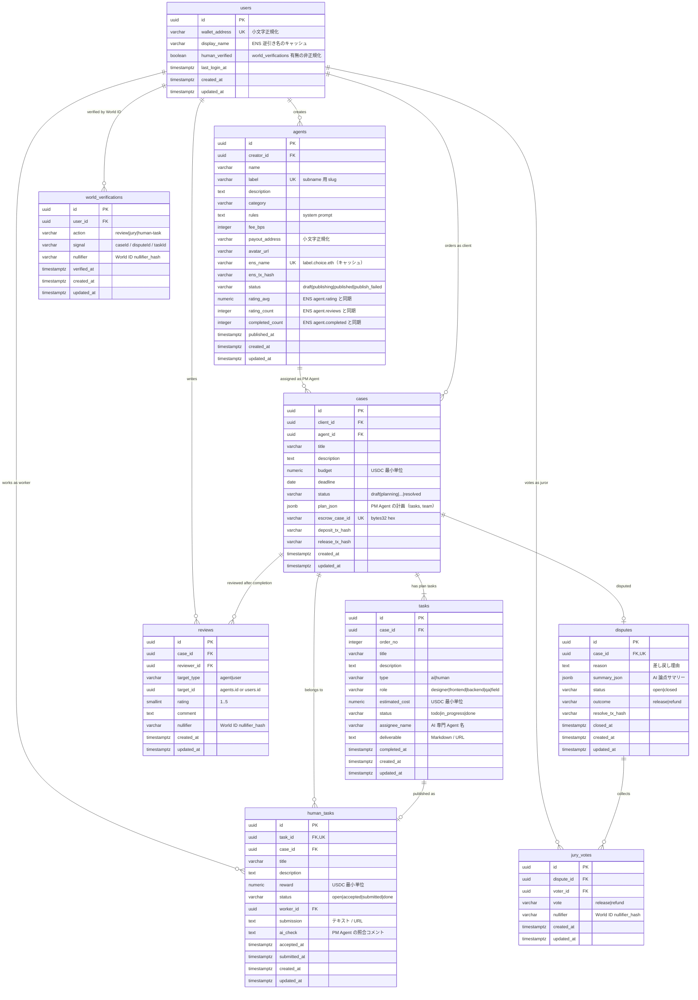

# ER図

> 参照資料: `docs/specs/20260925-agent-marketplace-mvp.md`（正本）、`docs/ETH_Globalユースケース.pdf`、`docs/01-アーキテクチャ図.svg`、`contracts/src/Escrow.sol`
> 最終更新: 2026-09-25

型の長さ・精度・CHECK 制約などの詳細は [database-design.md](./database-design.md) を参照。

## リレーション概要

- users 1 : N agents — PM Agent Creator（`creator_id`）が複数の PM Agent を作成する。
- users 1 : N cases — 発注者（`client_id`）が複数の案件を作成する。
- agents 1 : N cases — 1 案件は 1 つの PM Agent を利用する。
- cases 1 : N tasks — PM Agent の計画で生成されたタスク（AI / Human）。`order_no` で実行順を持つ。
- tasks 1 : 0..1 human_tasks — `type=human` のタスクだけが Human Task Marketplace に公開される（`task_id` UNIQUE）。
- cases 1 : N human_tasks — 一覧画面で「元案件」を引くための冗長 FK（tasks 経由でも辿れる。理由は設計書 4.5 参照）。
- users 1 : N human_tasks — Human Task Worker（`worker_id`）。受注前は NULL。
- cases 1 : N reviews — `completed` / `resolved` 後に当事者が投稿。`target_type` + `target_id` で Agent か User かを指す（ポリモーフィック参照のため FK は張らない）。
- users 1 : N reviews — 投稿者（`reviewer_id`）。
- cases 1 : 0..1 disputes — 「差し戻し」で 1 件だけ作成（MVP では案件ごとに 1 紛争。`case_id` UNIQUE）。
- disputes 1 : N jury_votes — Jury の投票（3 票で確定）。`(dispute_id, voter_id)` UNIQUE。
- users 1 : N jury_votes — 投票者（`voter_id`）。当事者は投票不可（アプリ側で検証）。
- users 1 : N world_verifications — World ID 検証の記録。`(action, signal, nullifier)` UNIQUE で同一人物の二重投稿・二重投票・多重受注を防ぐ。
